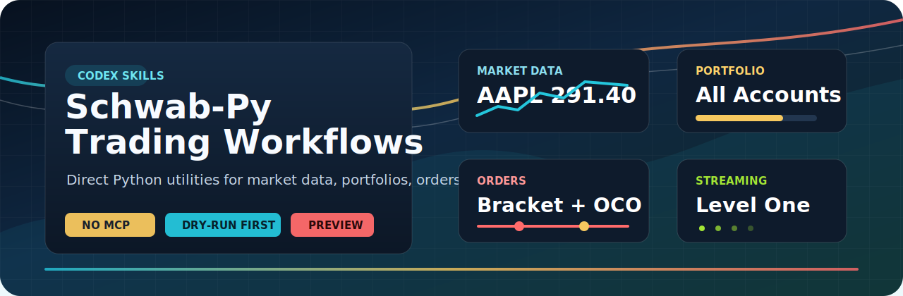

<p align="center">
  
</p>

<h1 align="center">Schwab-Py Codex Skills</h1>

<p align="center">
  Direct Schwab market data, portfolio, order, and streaming workflows for Codex without an MCP server.
</p>

<p align="center">
  
  
  
  
</p>

This is a Codex skills library first. It ships real `.codex/skills/*/SKILL.md`
workflows that tell Codex how to use `schwab-py` directly for Schwab market data,
portfolio, order, and streaming tasks without routing normal work through a
Schwab MCP server. The Python package and scripts in this repo are the local
execution layer those skills call.

## Available Codex Skills

Project skills live under `.codex/skills/<skill-name>/SKILL.md`. Open Codex in
this repo and start a prompt with the skill name, such as
`/schwab-market-data get a quote for AAPL and MSFT`.

| Skill | What It Enables Codex To Do | Example Prompts |
| --- | --- | --- |
| `schwab-setup` | Inspect and configure Schwab environment variables, validate `SCHWAB_TOKEN_PATH`, and preserve user-owned token configuration. | `/schwab-setup show my Schwab environment readiness` |
| `schwab-auth-client` | Create or validate a `schwab-py` client, check token status and age, verify token-file presence, and confirm account-hash readiness. | `/schwab-auth-client check auth` |
| `schwab-market-data` | Fetch quotes, multi-quotes, price history bars, option chains, option expirations, instruments, fundamentals, movers, and market hours. | `/schwab-market-data show the AAPL option chain near the money` |
| `schwab-portfolio` | Retrieve account hashes, balances, positions, transactions, linked-account summaries, order history, and account-combined position views. | `/schwab-portfolio show me a table of all my positions of all accounts combined` |
| `schwab-orders` | Build dry-run-first equity, option, spread, bracket, OCO, trigger, and strategy order JSON; preview, place, cancel, replace, and extract order IDs with explicit live-order safeguards. | `/schwab-orders show me a bracket order JSON for AAPL 1 share with normal risk stops` |
| `schwab-streaming` | Run bounded Schwab streaming workflows for level-one quotes, option quotes, chart data, level-two books, screeners, and account activity. | `/schwab-streaming AAPL MSFT` |

## How Codex Uses These Skills

When a user invokes one of the `/schwab-*` skills, Codex should load the matching
repo-local `SKILL.md`, run the relevant Python script or module from this repo,
and format the result for the requested task.

Use the skill prompt as the user interface:

```text
/schwab-market-data get a quote for AAPL and MSFT
/schwab-market-data get a quote for AAPL and MSFT show last price and fundamentals in a table
/schwab-market-data show the AAPL option chain near the money and save the full result to AAPL_Opt.csv
/schwab-portfolio show me a table of all my positions of all accounts combined
/schwab-orders show me a bracket order JSON for AAPL 1 share with normal risk stops
/schwab-auth-client show token status
/schwab-streaming AAPL MSFT
```

Codex behavior should be task-shaped:

- If the user asks for full JSON, return the raw command output.
- If the user asks for a table or comparison, extract the relevant fields and
  keep enough source detail to answer follow-ups.
- If the workflow writes a file, report the exact local filename and what was
  saved.
- If a live order mutation is requested, require the explicit confirmation flag
  described in the order skill and scripts.

For complete Codex-level behavior, examples, output shapes, and safety rules,
see [docs/CODEX_SKILL_USAGE.md](docs/CODEX_SKILL_USAGE.md). For local skill
deployment, see [docs/DEPLOYMENT.md](docs/DEPLOYMENT.md). For the installed
skill inventory, see [SKILLS_INVENTORY.md](SKILLS_INVENTORY.md).

## Install Python Support Code

```powershell
python -m pip install -e .[dev]
```

The editable Python package is support code for the Codex skills. Installing it
lets the repo-local `SKILL.md` workflows call `python -m schwab_py_skills...` and
the scripts under `scripts\`.

## Required Environment

Set these before using live Schwab calls:

- `SCHWAB_API_KEY`
- `SCHWAB_APP_SECRET`
- `SCHWAB_CALLBACK_URL`
- `SCHWAB_TOKEN_PATH`

`SCHWAB_TOKEN_PATH` is required and shared with other Schwab apps. This project
does not choose a default, move it, or recreate it somewhere else. Point it at
your existing Schwab token file.

Lowercase `schwab_*` names are accepted only as compatibility fallbacks for older
tools. The documented interface for this repo is uppercase `SCHWAB_*`.

Inspect or configure the environment:

```powershell
python -m schwab_py_skills.setup_env --show
python -m schwab_py_skills.setup_env
```

## Order Safety

Order commands build and print JSON by default. Live mutation requires explicit
flags:

```powershell
python scripts\place_order.py --order-file order.json --account-hash HASH --confirm-live-order
```

Previewing uses Schwab's `preview_order` endpoint and is allowed without placing
an order:

```powershell
python scripts\preview_order.py --order-file order.json --account-hash HASH
```

For deeper order examples, see [docs/ORDER_STRATEGY_EXAMPLES.md](docs/ORDER_STRATEGY_EXAMPLES.md).

## Python Utility Examples

```powershell
python scripts\check_auth.py
python scripts\token_info.py
python scripts\get_quotes.py AAPL MSFT
python scripts\get_quotes.py AAPL --fields quote fundamental
python scripts\get_price_history.py AAPL --period-type day --period one-day --frequency-type minute --frequency every-minute
python scripts\get_option_chain.py AAPL --contract-type call --strike-count 10 --include-underlying-quote
python scripts\get_option_expirations.py AAPL
python scripts\get_instruments.py AAPL --projection fundamental
python scripts\get_market_hours.py --markets equity option
python scripts\get_movers.py --index spx --sort-order percent-change-up --frequency five
python scripts\get_portfolio.py --positions
python scripts\get_portfolio.py --all-linked --positions
python scripts\get_transactions.py --symbol AAPL --transaction-type trade
python scripts\get_orders.py --status filled --max-results 10
python scripts\build_equity_order.py --side buy --symbol AAPL --qty 1 --type limit --price 150
python scripts\build_option_order.py --action buy-to-open --symbol "AAPL  260117C00150000" --contracts 1 --limit 1.25
python scripts\build_spread_order.py --strategy vertical --long "AAPL  260117C00145000" --short "AAPL  260117C00150000" --contracts 1 --net-debit 2.00
python scripts\build_strategy_order.py bracket --symbol AAPL --qty 1 --entry-price 291.34 --profit-target 303.00 --stop-loss 285.52
python scripts\build_strategy_order.py iron-condor --put-long "AAPL  260117P00280000" --put-short "AAPL  260117P00285000" --call-short "AAPL  260117C00300000" --call-long "AAPL  260117C00305000" --contracts 1 --net-credit 1.25
python scripts\stream_quotes.py --symbols AAPL MSFT --duration 30 --fields bid-price ask-price last-price total-volume
python scripts\stream_quotes.py --service account-activity --duration 30
```

Live order maintenance commands:

```powershell
python scripts\get_order.py --order-id 123 --account-hash HASH
python scripts\cancel_order.py --order-id 123 --account-hash HASH --confirm-live-order
python scripts\replace_order.py --order-id 123 --order-file replacement.json --account-hash HASH --confirm-live-order
```

## Deploy Codex Skills Locally

```powershell
pwsh -ExecutionPolicy Bypass -File .\scripts\deploy-skills.ps1 -WhatIf
pwsh -ExecutionPolicy Bypass -File .\scripts\deploy-skills.ps1
```

## Validation

```powershell
python -m compileall src scripts tests
python -m pytest
python -m ruff check .
```
